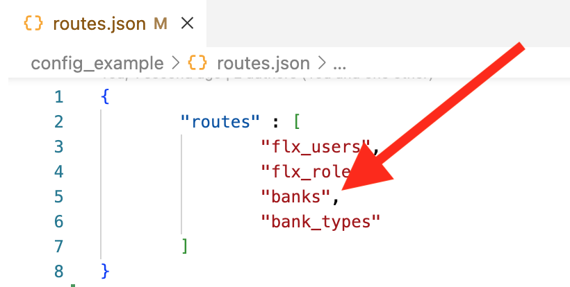
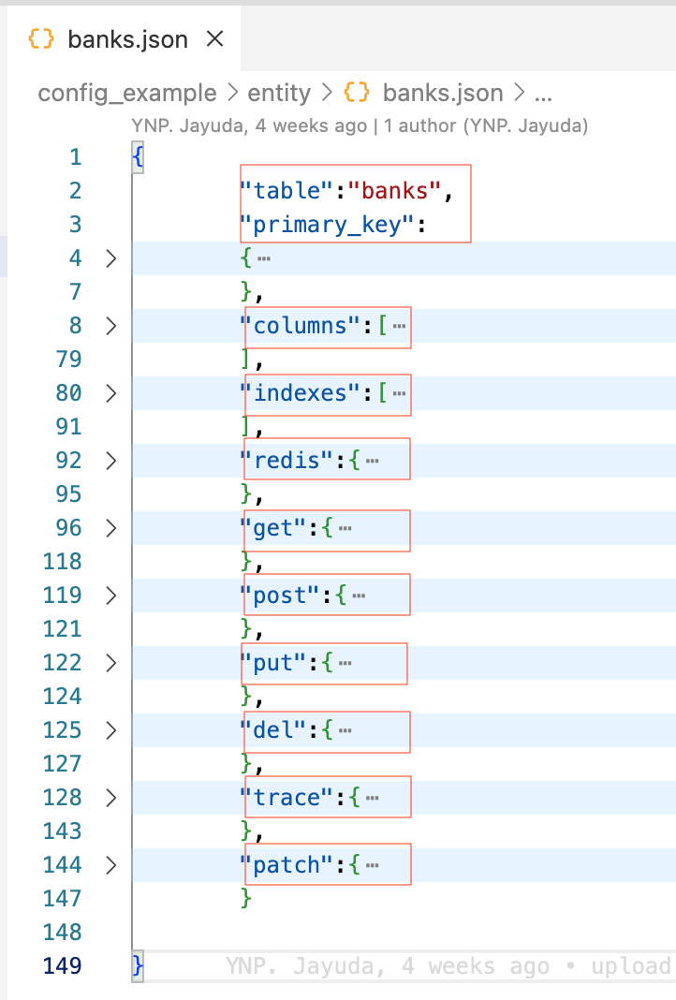

# FLEXURIO NOCODE API

## Installation

Type git `clone`, and then paste the URL you copied earlier.

```bash
 git clone https://github.com/flexurio/flx-nocode-api.git
```
Go to the project directory

```bash
  cd/flx-nocode-api
```
Go to text editor.

```bash
  code .
```
Start the server `adjust the OS you are using`.

```bash
  ./flx-nocode-aarch64-apple-darwin
  ./flx-nocode-x86_64-apple-darwin
  ./flx-nocode-x86_64-pc-windows-gnu.exe
```        

After running is complete, the `flx_users` and `flx_roles` tables will be formed.
Check the log when running, you will get an administrator account with the name `Admin Flexurio`.


## Environment Variables

To run this project, you will need to add the following environment variables to your .env file

`PORT=`
`REDIS_HOST=`

`REDIS_PORT=`
`REDIS_PASSWORD=`

`REDIS_DB=`
`DATABASE_URL=`

`DEBUG=`
`BASE_URL=`

`SECRET_KEY=`
`ENCRYPT_KEY=`

`LOC_CONFIG=`
`LOC_IMAGE=`

`LOC_LOG=`


## Roadmap

- If you want to add a new API then add it in the list in the `route.json` file

- Then create an API configuration in `config_example` -> `entity` -> create a file like the name in the list in the routes.json file

- Continue to create an API configuration like the sample in flx_user, there is already a `GET` `POST` `PUT` `DELETE` `PATCH` `TRACE` method


## Example

- Add new route name to add new api example `banks`


- Create new file in `config_example` -> `entity` -> `banks` (use the same file name as the name of the route you created)


- Run your project after running search `banks`


- Run endpoint `validate/banks` to check whether the format in the `bank` entity is correct (OK) or not (NOT OK)
